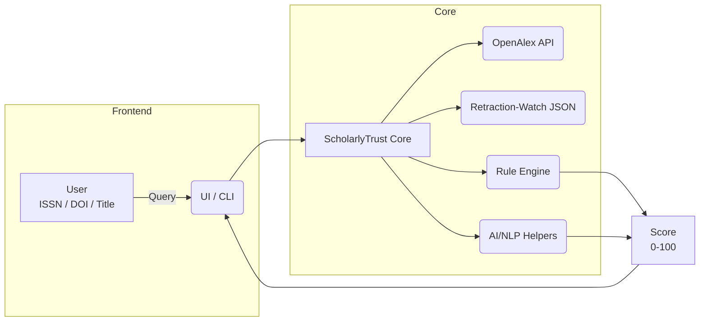

# ScholarlyTrust: Research Integrity Checker

**ScholarlyTrust** is a web-based tool designed to help researchers, academics, and institutions evaluate the legitimacy of journals and research papers. The tool uses trusted metadata and confidence scores to provide insights into the credibility of journals and papers, helping users avoid predatory publishers and unreliable sources.

---

## Features

- **Journal Validation**: Check the legitimacy of journals using their ISSN or name.
- **Research Paper Validation**: Evaluate research papers using their DOI or title.
- **Metadata Insights**: View detailed metadata for journals and papers, including publisher, citation counts, DOAJ status, and more.
- **Confidence Scoring**: Get a confidence score (0-100%) indicating the likelihood of legitimacy.
- **User-Friendly Interface**: Built with Streamlit for an intuitive and interactive experience.

---

## ✨ What Is ScholarlyTrust?

ScholarlyTrust is a **free, open-source credibility engine** that scores journals and individual research papers on a 0-100 scale.  
It combines:

1. **Trusted scholarly metadata** – pulled live from [OpenAlex](https://openalex.org) and (optionally) the Retraction Watch database.  
2. **Rule-based heuristics** – proven red-flag checks (e.g., not indexed in DOAJ, suspicious APCs, hijacked ISSN).  
3. **AI assistance** – a lightweight language-model layer (Anthropic Claude / GPT) that spots subtler issues (odd journal titles, boilerplate peer-review claims, etc.) and generates plain-language explanations.

Think of it as **“Retraction Watch × DOAJ × ChatGPT”** in one package—so science journalists, librarians, and researchers can **instantly** gauge whether a source is likely legitimate, questionable, or predatory.

---

## 🔑 Key Features

| Feature | Journals | Papers |
|---------|----------|--------|
| Index & whitelist checks (Scopus, DOAJ, CORE) | ✅ | ✅ *(via journal of record)* |
| Hijacked‐journal detection | ✅ | — |
| Retraction & expression-of-concern lookup | ✅ | ✅ |
| Citation & impact outlier analysis | ✅ | ✅ |
| APC transparency & fee anomaly check | ✅ | — |
| AI title / website language scan | ✅ | — |
| Author ORCID & affiliation sanity check | — | ✅ |
| 0–100 confidence score + color badge | ✅ | ✅ |
| Plain-language rationale (“Why this score?”) | ✅ | ✅ |

---

## 🏗️ Architecture (High Level)



---

## Installation

1. Clone the repository:
   ```bash
   git clone https://github.com/your-username/ScholarlyTrust.git
   cd ScholarlyTrust
   ```

2. Install dependencies:
   ```bash
   pip install -r requirements.txt
   ```

3. Run the application:
   ```bash
   streamlit run src/main.py
   ```

4. Open the app in your browser at `http://localhost:8501`.

---

## Folder Structure

```
ScholarlyTrust/
├── src/                      # Source code
│   ├── main.py               # Main Streamlit app
│   ├── api_utils.py          # Utility functions for API calls
│   └── ...                   # Other source files
├── requirements.txt          # Python dependencies
└── README.md                 # Project documentation
```

---

## Technologies Used

- **Python**: Core programming language.
- **Streamlit**: Framework for building the web interface.
- **Requests**: For making API calls.
- **HTML/CSS**: For custom styling in Streamlit.

---

## Contributing

Contributions are welcome! If you'd like to contribute, please fork the repository and submit a pull request.

---

## License

This project is licensed under the [MIT License](LICENSE).

---

## Acknowledgments

- **Anthropic**: For providing AI-powered insights.
- **Developed by**: [Abhishek Bakare](https://www.linkedin.com/in/abhishekbakare/)

---

## Contact

For questions or support, please contact [Abhishek Bakare](mailto:abakre5@gmail.com).